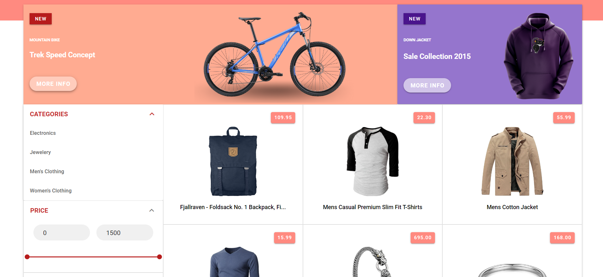
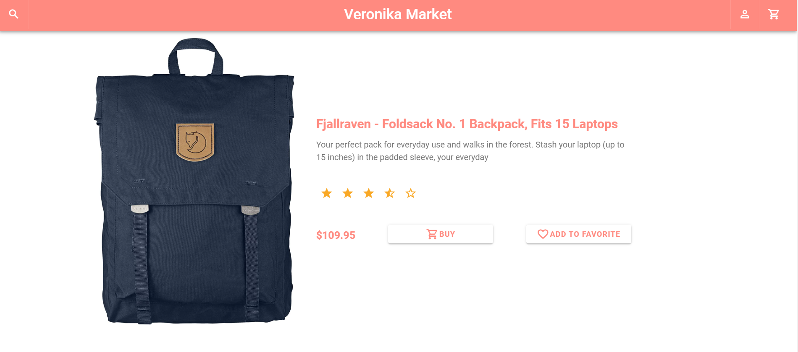
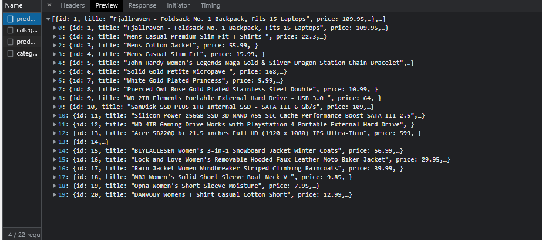
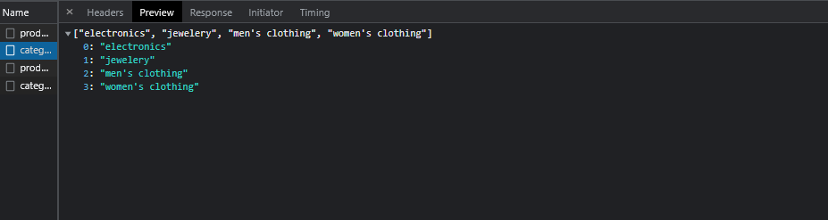
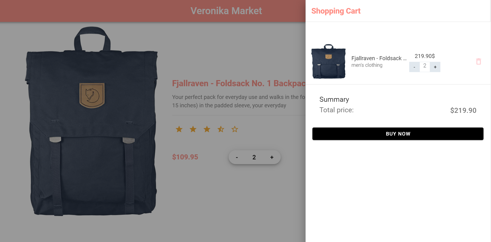
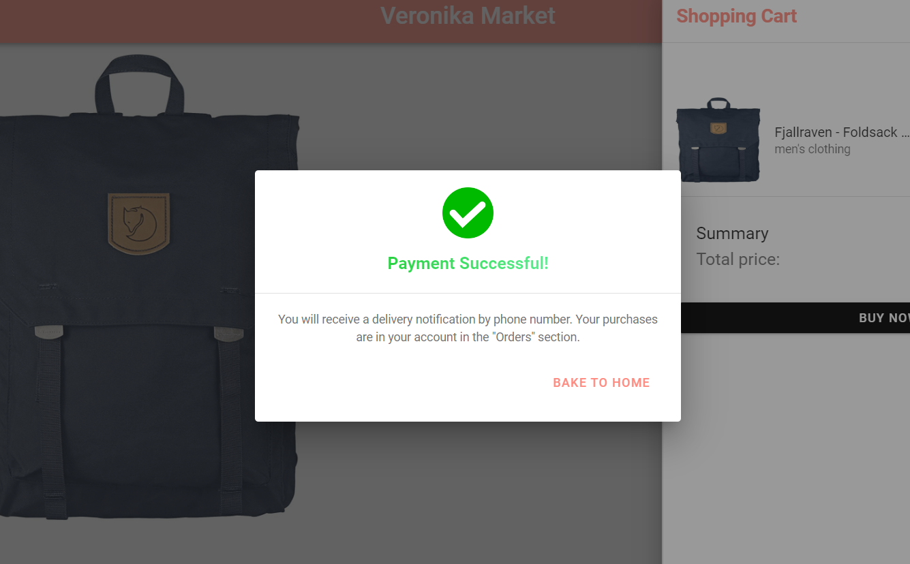
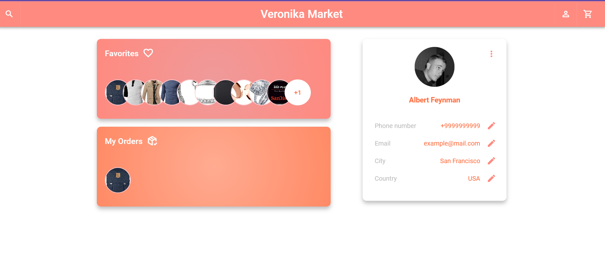
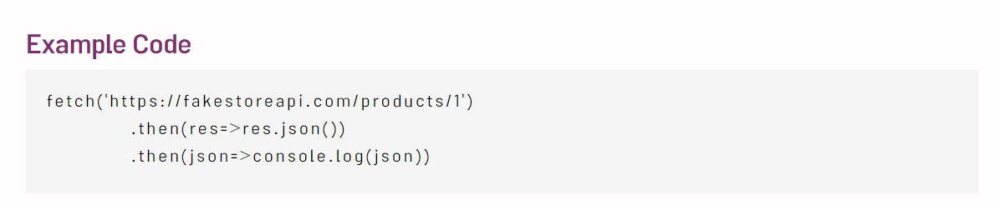

#  E-commerce Website

An e-commerce sample website built with Vue.js 2, using vuex and vue-router.

This is built on VueJs. Centralized state management is implemented with Vuex. Routing is done with Vue Router.

Designed with Vuetify and CSS.

### Motivation
I decided to make this project for educational purposes while studying Vue.js 2. 

### TODO

✔️ Product details page

✔️ Fetch data from API for products and catefories filter. 

✔️ Cart and order (from main page and product page)

✔️ Payment simulation

✔️The ability to add a product to favorites

✔️ User Page, where orders, favorite products and user information are located

### API Reference

https://fakestoreapi.com/

### Project setup
npm install
### Compiles and hot-reloads for development
npm run serve
### Compiles and minifies for production
npm run build
